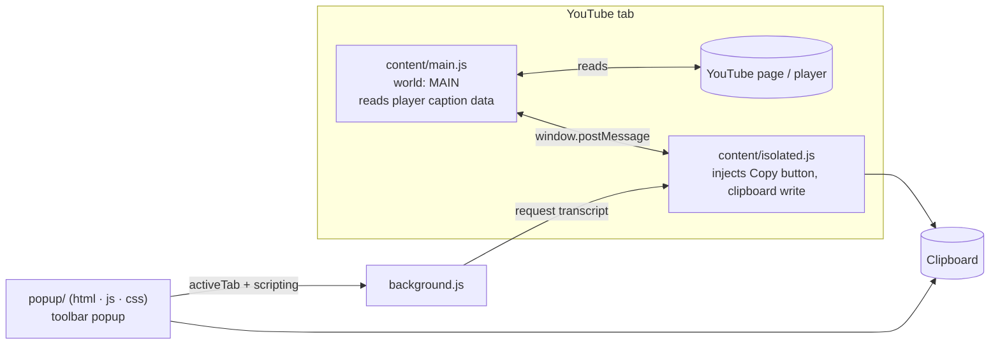

# Architecture

A Firefox WebExtension (Manifest V3) that copies a YouTube video's captions as timestamped text.

The MAIN-world script can see page JS objects; the isolated-world script has extension APIs. They talk via `postMessage`.
